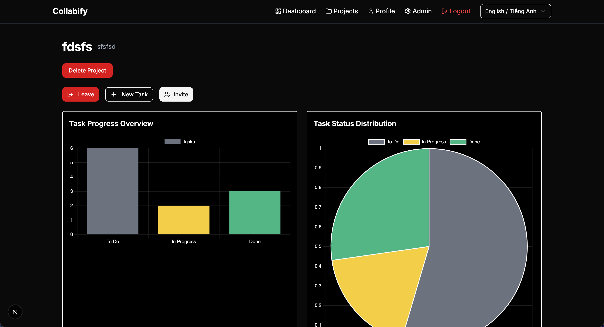

# Collabify - A GitHub Project Board Alternative 📈

[](https://nextjs.org/)
[](https://tailwindcss.com/)
[](https://ui.shadcn.com/)
[](https://auth0.com/)
[](https://www.mongodb.com/)
[](LICENSE)

Collabify is a modern, feature-rich project management tool designed to help teams plan, organize, and collaborate seamlessly. Built on [Next.js](https://nextjs.org/) (as a full-stack framework), styled with [Tailwind CSS](https://tailwindcss.com/), and powered by [Shadcn UI](https://ui.shadcn.com/), Collabify provides a great user experience with beautiful UI components and smooth animations via [Framer Motion](https://www.framer.com/motion/).

One of the key features is secure authentication using [Auth0](https://auth0.com/), which is integrated using both Regular Web Applications (RWA) and Machine-to-Machine (M2M) credentials. MongoDB is used as the primary database to store projects and tasks.

## Table of Contents

- [Overview](#overview)
- [Features](#features)
- [Tech Stack](#tech-stack)
- [User Interface](#user-interface)
- [API Endpoints](#api-endpoints)
- [Getting Started](#getting-started)
  - [Prerequisites](#prerequisites)
  - [Installation](#installation)
  - [Environment Variables](#environment-variables)
- [Auth0 Setup Guide](#auth0-setup-guide)
  - [1. Setting Up Your Auth0 Tenant](#1-setting-up-your-auth0-tenant)
  - [2. Creating the Regular Web Application (RWA)](#2-creating-the-regular-web-application-rwa)
  - [3. Creating the Machine-to-Machine (M2M) Application](#3-creating-the-machine-to-machine-m2m-application)
  - [4. Configuring Your Auth0 API and Client Grants](#4-configuring-your-auth0-api-and-client-grants)
- [Deployment](#deployment)
- [License](#license)
- [Contact](#contact)
- [Contributing](#contributing)
- [Conclusion](#conclusion)

## Overview

Collabify helps teams manage projects and tasks effortlessly. With its intuitive interface, robust security through Auth0, and real-time analytics, Collabify is ideal for organizations looking to boost productivity and collaboration. Its modern UI is built using Next.js, Tailwind CSS, and Shadcn UI components, while animations provided by Framer Motion enhance the user experience.

Currently live at: [https://collabify-pm.vercel.app/](https://collabify-pm.vercel.app/). Create an account and start managing your projects today! 🚀

## Features

- **Secure Authentication & Authorization:** Collabify uses Auth0 to manage user sign-up, login, and secure role-based access. It supports both regular web applications and machine-to-machine integrations.

- **Project Management:** Users can create new projects, join existing ones, and view a list of projects they belong to.

- **Task Management:** Add tasks to projects, assign them to team members, and track progress with interactive charts.

- **Real-Time Analytics:** Visual dashboards (Bar, Pie, Line charts, etc.) built with Chart.js provide insights into task status and project progress.

- **Modern & Responsive UI:** Built with Next.js and Tailwind CSS, the UI is responsive and polished with smooth animations from Framer Motion and UI components from Shadcn UI.

- **Database Integration:** MongoDB is used for data storage, ensuring reliable and scalable data management.

- **User Roles:** Role-Based Access Control (RBAC) allows for different permissions based on user roles, enhancing security and collaboration.

- **User-Friendly Interface:** The application is designed to be intuitive and easy to navigate, making it accessible for users of all skill levels.

## Tech Stack

- **Framework:** [Next.js](https://nextjs.org/)
- **Styling:** [Tailwind CSS](https://tailwindcss.com/)
- **UI Components:** [Shadcn UI](https://ui.shadcn.com/)
- **Authentication:** [Auth0](https://auth0.com/)
- **Database:** [MongoDB](https://www.mongodb.com/) (via Mongoose)
- **Charts:** [Chart.js](https://www.chartjs.org/) with [react-chartjs-2](https://github.com/reactchartjs/react-chartjs-2)
- **Animations:** [Framer Motion](https://www.framer.com/motion/)
- **Icons:** [Lucide React](https://lucide.dev/)
- **State Management:** [React Query](https://react-query.tanstack.com/) for data fetching and caching
- **Deployment:** [Vercel](https://vercel.com/) (recommended for Next.js apps)
- **and more!**

## User Interface

### Landing Page

<p align="center">
  
</p>

### Dashboard

<p align="center">
  
</p>

### Project List Page

<p align="center">
  
</p>

### Project Details Page

<p align="center">
  
</p>

### Admin Panel

<p align="center">
  
</p>

### Swagger API Documentation

<p align="center">
  
</p>

**and more!**

## API Endpoints

Collabify provides a set of RESTful API endpoints for managing projects, tasks, and users. The API is designed to be intuitive and easy to use, with clear documentation available in the codebase.

| Endpoint                                   | Method         | Description                                               |
| ------------------------------------------ | -------------- | --------------------------------------------------------- |
| `/api/admin/roles`                         | GET/POST       | Manage admin user roles                                   |
| `/api/auth/[...auth0]`                     | _Varies_       | Auth0 authentication routes (callback, logout, etc.)      |
| `/api/logs`                                | GET            | Retrieve application logs                                 |
| `/api/projects`                            | GET/POST       | List all projects or create a new project                 |
| `/api/projects/[id]`                       | GET/PUT/DELETE | Retrieve, update, or delete a specific project            |
| `/api/projects/[id]/tasks`                 | GET            | Get tasks for a specific project                          |
| `/api/projects/[id]/tasks/tasks`           | POST           | Create a new task for the project                         |
| `/api/projects/[id]/tasks/join`            | POST           | Join a task under the specified project                   |
| `/api/projects/[id]/tasks/leave`           | POST           | Leave a task under the specified project                  |
| `/api/projects/[id]/tasks/[taskId]/toggle` | PATCH          | Toggle task state (e.g., complete/incomplete)             |
| `/api/projects/[id]/tasks/index`           | GET            | Index endpoint for tasks (possible metadata or summaries) |
| `/api/users/info`                          | GET            | Get user profile/info                                     |
| `/api/users/logs`                          | GET            | Get user activity logs                                    |
| `/api/users/roles`                         | GET            | Get roles associated with the user                        |

To access the API documentation, you can use the Swagger UI integrated into the application. Simply navigate to `/api-docs` in your browser after starting the application. This will provide you with a user-friendly interface to explore the available endpoints, their parameters, and expected responses.

## Getting Started

### Prerequisites

Before starting, make sure you have:

- **Node.js** (v14 or later) installed
- **npm** or **Yarn** installed
- A **MongoDB** instance or a MongoDB Atlas account
- An **Auth0** account

### Installation

1. **Clone the repository:**

   ```bash
   git clone https://github.com/yourusername/collabify.git
   cd collabify
   ```

2. **Install dependencies:**

   ```bash
   npm install
   # or
   yarn install
   ```

### Environment Variables

Create a file called `.env.local` in the root directory and add the following variables (adjust values as needed):

```
AUTH0_SECRET=your_auth0_secret_here
AUTH0_BASE_URL=http://localhost:3000
AUTH0_ISSUER_BASE_URL=https://your-auth0-domain.auth0.com
AUTH0_CLIENT_ID=your_auth0_client_id
AUTH0_CLIENT_SECRET=your_auth0_client_secret
MONGODB_URI=your_mongodb_connection_string
AUTH0_AUDIENCE=https://yourapi.example.com/
AUTH0_M2M_CLIENT_ID=your_m2m_client_id
AUTH0_M2M_CLIENT_SECRET=your_m2m_client_secret
AUTH0_TENANT_DOMAIN=your-auth0-tenant-domain.auth0.com
```

## Auth0 Setup Guide

Follow these steps to configure Auth0 for Collabify:

### 1. Setting Up Your Auth0 Tenant

1. **Sign Up/Log In:**  
   Visit [Auth0](https://auth0.com/) and sign up or log in.

2. **Create a New Tenant:**  
   If you don’t already have a tenant, create one. For example, use a name like `dev-collabify`.

3. **Note Your Domain:**  
   In the Auth0 Dashboard, your domain will look like `dev-ywgxp8dwn5jtlj3a.us.auth0.com`. Use this domain in your environment variables (see above).

### 2. Creating the Regular Web Application (RWA)

1. In the Auth0 Dashboard, navigate to **Applications > Applications**.
2. Click **Create Application**.
3. **Name your application:** e.g., "Collabify RWA".
4. **Select Application Type:** Choose **Regular Web Applications**.
5. **Configure Allowed URLs:**

- **Allowed Callback URLs:** `http://localhost:3000/api/auth/callback`
- **Allowed Logout URLs:** `http://localhost:3000`
- **Allowed Web Origins:** `http://localhost:3000`

6. **Save your settings.**
7. Copy the **Client ID** and **Client Secret** into your `.env.local` as `AUTH0_CLIENT_ID` and `AUTH0_CLIENT_SECRET`.

### 3. Creating the Machine-to-Machine (M2M) Application

1. In the Auth0 Dashboard, go to **Applications > Applications**.
2. Click **Create Application**.
3. **Name your application:** e.g., "Collabify M2M".
4. **Select Application Type:** Choose **Machine to Machine Applications**.
5. **Authorize Access:**  
   Under **APIs**, authorize your API (created in the next step) with the necessary scopes.
6. Copy the **Client ID** and **Client Secret** into your `.env.local` as `AUTH0_M2M_CLIENT_ID` and `AUTH0_M2M_CLIENT_SECRET`.

### 4. Configuring Your Auth0 API and Client Grants

1. In the Auth0 Dashboard, navigate to **APIs**.
2. Click **Create API**.
3. **Name your API:** e.g., "Collabify API".
4. **Identifier:** Set it to `https://myapp.example.com/` (this will be your audience, `AUTH0_AUDIENCE`).
5. **Signing Algorithm:** Choose **RS256**.
6. Save your API.
7. In your M2M application settings (from step 3), grant it the required scopes to interact with this API (e.g., `read:users`, `update:users`, `read:roles`, etc.).
8. Now your Auth0 setup is complete.

### 5. Testing the Application

1. **Run the development server:**

   ```bash
   npm run dev
   # or
   yarn dev
   ```

2. **Open your browser:** Go to [http://localhost:3000](http://localhost:3000).

3. **Sign Up/Log In:** Use the login button to authenticate with Auth0. You should be redirected to the Auth0 login page. Upon successful login, you will be redirected back to your application, automatically.

## Deployment

Collabify is built with Next.js, so it’s optimized for platforms like [Vercel](https://vercel.com/). For deployment:

1. **Push your code to GitHub (or your preferred Git provider).**
2. **Connect your repository to Vercel.**
3. **Set up your environment variables on Vercel:**  
   Use the same values as in your `.env.local`.
4. **Deploy your project.**

For other platforms, refer to the [Next.js deployment documentation](https://nextjs.org/docs/deployment).

## License

This project is licensed under the [MIT License](LICENSE).

## Contact

For questions or contributions, please reach out to [Son Nguyen](https://sonnguyenhoang.com).

## Contributing

Contributions are welcome! If you have suggestions for improvements or new features, feel free to open an issue or submit a pull request.

1. Fork the repository
2. Create a new branch (`git checkout -b feature/YourFeature`)
3. Make your changes
4. Commit your changes (`git commit -m 'Add some feature'`)
5. Push to the branch (`git push origin feature/YourFeature`)
6. Open a pull request
7. Wait for review and feedback

We appreciate your contributions to make Collabify even better!

Also, feel free to open an issue if you find any bugs or have feature requests. We are always looking to improve the application and your feedback is invaluable.

## Conclusion

Collabify is designed with a great UI powered by Next.js, Tailwind CSS, and Shadcn UI, and leverages Auth0 for secure authentication and MongoDB for reliable data storage. This README should help you set up and get started with the project even if you’re a beginner.

---

Happy managing your projects with Collabify! If you have any questions or need assistance, feel free to reach out. Enjoy building and collaborating! 🎉
