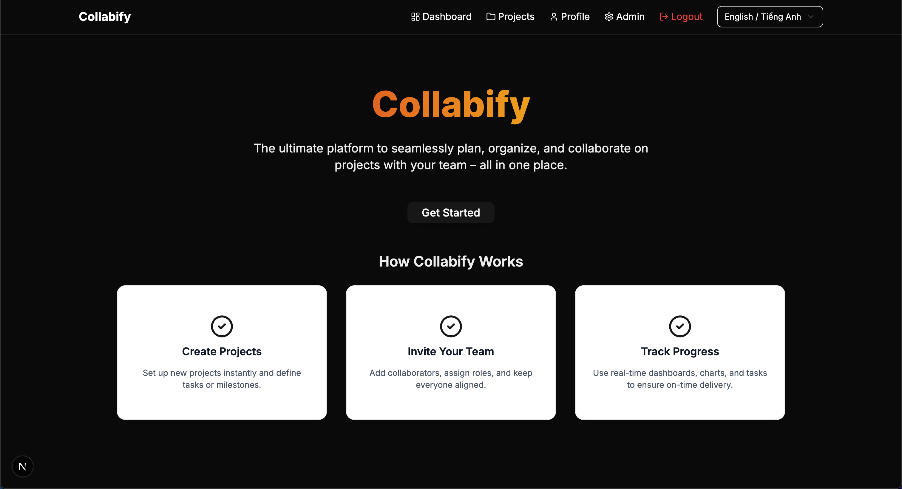
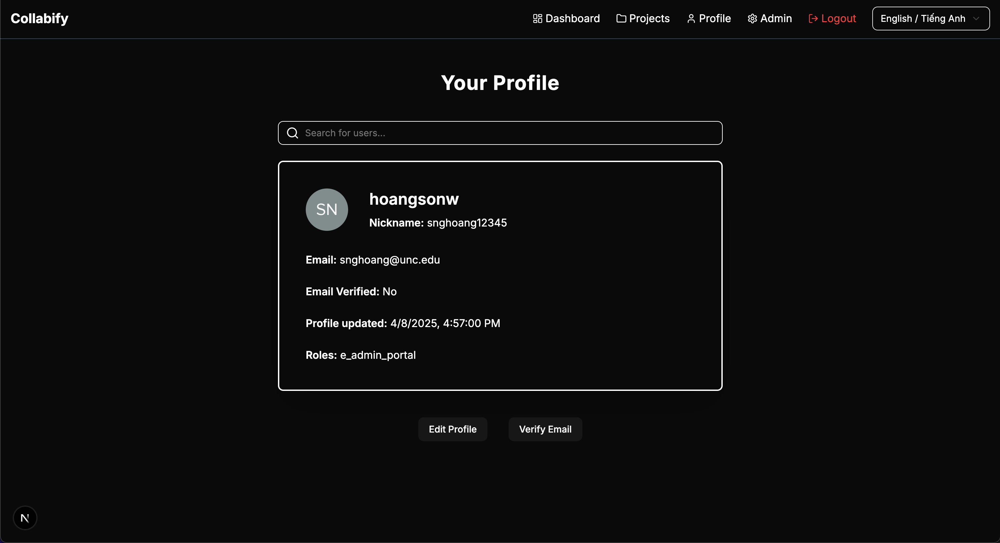
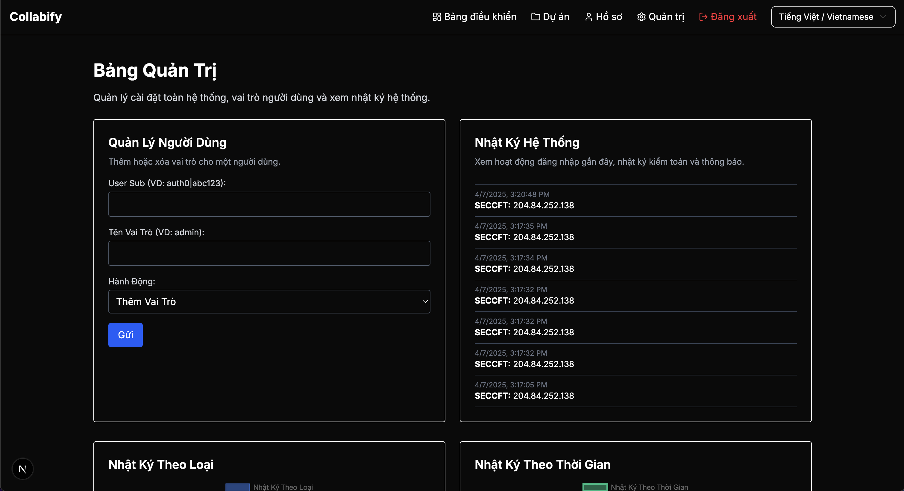

# Collabify - A Jira & Trello Alternative 🧩

[](https://nextjs.org/)
[](https://tailwindcss.com/)
[](https://ui.shadcn.com/)
[](https://auth0.com/)
[](https://www.mongodb.com/)
[](https://tanstack.com/query/latest)
[](https://www.i18next.com/)
[](https://www.typescriptlang.org/)
[](https://vercel.com/)
[](https://eslint.org/)
[](https://prettier.io/)
[](https://www.framer.com/motion/)
[](https://www.chartjs.org/)
[](https://www.docker.com/)
[](LICENSE)

**Collabify** is a modern, feature-rich project management tool designed to help teams plan, organize, and collaborate seamlessly. Built on [Next.js](https://nextjs.org/) (as a full-stack framework), styled with [Tailwind CSS](https://tailwindcss.com/), and powered by [Shadcn UI](https://ui.shadcn.com/), Collabify provides a great user experience with beautiful UI components and smooth animations via [Framer Motion](https://www.framer.com/motion/).

One of the key features is secure authentication using [Auth0](https://auth0.com/), which is integrated using both Regular Web Applications (RWA) and Machine-to-Machine (M2M) credentials, with Role-Based Access Control (RBAC) for enhanced security. The application also utilizes [MongoDB](https://www.mongodb.com/) for data storage, ensuring reliable and scalable data management. Internationalization (i18n) support is provided through the [i18next](https://www.i18next.com/) library, allowing for easy localization of the application.

<p align="center">
  
</p>

## Table of Contents

- [Overview](#overview)
- [Features](#features)
- [Tech Stack](#tech-stack)
- [User Interface](#user-interface)
- [API Endpoints](#api-endpoints)
- [Getting Started](#getting-started)
  - [Prerequisites](#prerequisites)
  - [Installation](#installation)
  - [Environment Variables](#environment-variables)
- [Why Auth0?](#why-auth0)
  - [Benefits of using Auth0](#benefits-of-using-auth0)
- [Auth0 Setup Guide](#auth0-setup-guide)
  - [1. Setting Up Your Auth0 Tenant](#1-setting-up-your-auth0-tenant)
  - [2. Creating the Regular Web Application (RWA)](#2-creating-the-regular-web-application-rwa)
  - [3. Creating the Machine-to-Machine (M2M) Application](#3-creating-the-machine-to-machine-m2m-application)
  - [4. Configuring Your Auth0 API and Client Grants](#4-configuring-your-auth0-api-and-client-grants)
  - [5. Testing the Application](#5-testing-the-application)
- [Shadcn UI](#shadcn-ui)
- [Tailwind CSS](#tailwind-css)
- [Internationalization (i18n)](#internationalization-i18n)
- [Deployment](#deployment)
- [Containerization](#containerization)
- [License](#license)
- [Contact](#contact)
- [Contributing](#contributing)
- [Conclusion](#conclusion)

## Overview

Collabify helps teams manage projects and tasks effortlessly. With its intuitive interface, robust security through Auth0, and real-time analytics, Collabify is ideal for organizations looking to boost productivity and collaboration. Its modern UI is built using Next.js, Tailwind CSS, and Shadcn UI components, while animations provided by Framer Motion enhance the user experience.

Currently live at: [https://collabify-pm.vercel.app/](https://collabify-pm.vercel.app/). Create an account and start managing your projects today! 🚀

## Features

- **Secure Authentication & Authorization:** Collabify uses Auth0 to manage user sign-up, login, and secure role-based access. It supports both regular web applications and machine-to-machine integrations.

- **Project Management:** Users can create new projects, join existing ones, and view a list of projects they belong to.

- **Task Management:** Add tasks to projects, assign them to team members, and track progress with interactive charts.

- **Real-Time Analytics:** Visual dashboards (Bar, Pie, Line charts, etc.) built with Chart.js provide insights into task status and project progress.

- **Modern & Responsive UI:** Built with Next.js and Tailwind CSS, the UI is responsive and polished with smooth animations from Framer Motion and UI components from Shadcn UI.

- **Database Integration:** MongoDB is used for data storage, ensuring reliable and scalable data management.

- **User Roles:** Role-Based Access Control (RBAC) allows for different permissions based on user roles, enhancing security and collaboration within teams.

- **User-Friendly Interface:** The application is designed to be intuitive and easy to navigate, making it accessible for users of all skill levels.

## Tech Stack

Collabify is built using a modern tech stack that ensures a great user experience and robust functionality. Here are the key technologies used in this project:

- **Framework:** [Next.js](https://nextjs.org/)
- **Styling:** [Tailwind CSS](https://tailwindcss.com/)
- **UI Components:** [Shadcn UI](https://ui.shadcn.com/)
- **Authentication:** [Auth0](https://auth0.com/)
- **Database:** [MongoDB](https://www.mongodb.com/) (via Mongoose)
- **Charts:** [Chart.js](https://www.chartjs.org/) with [react-chartjs-2](https://github.com/reactchartjs/react-chartjs-2)
- **Animations:** [Framer Motion](https://www.framer.com/motion/)
- **Icons:** [Lucide React](https://lucide.dev/)
- **State Management:** [React Query](https://react-query.tanstack.com/) for data fetching and caching
- **Deployment:** [Vercel](https://vercel.com/) (recommended for Next.js apps)
- **Code Formatting:** [Prettier](https://prettier.io/) for consistent code style
- **Linting:** [ESLint](https://eslint.org/) for identifying and fixing code quality issues
- **Version Control:** [Git](https://git-scm.com/) for version control and collaboration
- **and many more!**

## User Interface

Collabify features a modern and user-friendly interface designed to enhance productivity and collaboration. The UI is built using Next.js, Tailwind CSS, and Shadcn UI components, providing a responsive and polished experience. Below are some screenshots of the application:

### Landing Page

<p align="center">
  
</p>

### Dashboard

<p align="center">
  
</p>

### Dashboard - Vietnamese

<p align="center">
  
</p>

### Project List Page

<p align="center">
  
</p>

### Project Details Page

<p align="center">
  
</p>

### Project Details Page - Vietnamese

<p align="center">
  
</p>

### Tasks Table

<p align="center">
  
</p>

### Profile Page

<p align="center">
  
</p>

### Admin Panel

<p align="center">
  
</p>

### Swagger API Documentation

<p align="center">
  
</p>

**and more...**

The UI is designed to be intuitive and easy to navigate, making it accessible for users of all skill levels. The use of Tailwind CSS ensures that the application is responsive and looks great on all devices.

The UI may be updated in the future to include more features and improvements. Feel free to explore the codebase and customize the UI components as needed.

## API Endpoints

Collabify provides a set of RESTful API endpoints for managing projects, tasks, and users. The API is designed to be intuitive and easy to use, with clear documentation available in the codebase.

| Endpoint                                   | Method         | Description                                               |
| ------------------------------------------ | -------------- | --------------------------------------------------------- |
| `/api/admin/roles`                         | GET/POST       | Manage admin user roles                                   |
| `/api/auth/[...auth0]`                     | _Varies_       | Auth0 authentication routes (callback, logout, etc.)      |
| `/api/logs`                                | GET            | Retrieve application logs                                 |
| `/api/projects`                            | GET/POST       | List all projects or create a new project                 |
| `/api/projects/[id]`                       | GET/PUT/DELETE | Retrieve, update, or delete a specific project            |
| `/api/projects/[id]/tasks`                 | GET            | Get tasks for a specific project                          |
| `/api/projects/[id]/tasks/tasks`           | POST           | Create a new task for the project                         |
| `/api/projects/[id]/tasks/join`            | POST           | Join a task under the specified project                   |
| `/api/projects/[id]/tasks/leave`           | POST           | Leave a task under the specified project                  |
| `/api/projects/[id]/tasks/[taskId]/toggle` | PATCH          | Toggle task state (e.g., complete/incomplete)             |
| `/api/projects/[id]/tasks/index`           | GET            | Index endpoint for tasks (possible metadata or summaries) |
| `/api/users/info`                          | GET            | Get user profile/info                                     |
| `/api/users/logs`                          | GET            | Get user activity logs                                    |
| `/api/users/roles`                         | GET            | Get roles associated with the user                        |

To access the API documentation, you can use the Swagger UI integrated into the application. Simply navigate to `/api-docs` in your browser after starting the application. This will provide you with a user-friendly interface to explore the available endpoints, their parameters, and expected responses.

More API endpoints will be added in the future, and the documentation will be updated accordingly. The API is designed to be extensible, allowing for easy addition of new features and functionalities as needed.

## Getting Started

### Prerequisites

Before starting, make sure you have:

- **Node.js** (v14 or later) installed
- **npm** or **Yarn** installed
- A **MongoDB** instance or a MongoDB Atlas account
- An **Auth0** account

### Installation

1. **Clone the repository:**

   ```bash
   git clone https://github.com/hoangsonww/Collabify-Project-Manager.git
   cd collabify
   ```

2. **Install dependencies:**

   ```bash
   npm install # or npm install --legacy-peer-deps if you encounter issues
   # or
   yarn install
   ```

### Environment Variables

Create a file called `.env.local` in the root directory and add the following variables (adjust values as needed):

```
AUTH0_SECRET=your_auth0_secret_here
AUTH0_BASE_URL=http://localhost:3000
AUTH0_ISSUER_BASE_URL=https://your-auth0-domain.auth0.com
AUTH0_CLIENT_ID=your_auth0_client_id
AUTH0_CLIENT_SECRET=your_auth0_client_secret
MONGODB_URI=your_mongodb_connection_string
AUTH0_AUDIENCE=https://yourapi.example.com/
AUTH0_M2M_CLIENT_ID=your_m2m_client_id
AUTH0_M2M_CLIENT_SECRET=your_m2m_client_secret
AUTH0_TENANT_DOMAIN=your-auth0-tenant-domain.auth0.com
```

Note: MongoDB connection string should be in the format: `mongodb+srv://<username>:<password>@cluster.mongodb.net/<dbname>?retryWrites=true&w=majority`. Alternatively, if you are using a local MongoDB instance, it can be `mongodb://localhost:27017/collabify`.

## Why Auth0?

Collabify uses Auth0 for secure authentication and authorization. Auth0 provides a robust and scalable solution for managing user identities, roles, and permissions. By leveraging Auth0, we can ensure that user data is protected and that only authorized users have access to specific features and functionalities within the application.

### Benefits of using Auth0:

- **Security:** Auth0 provides advanced security features, including multi-factor authentication (MFA), anomaly detection, and secure token storage.
- **Scalability:** Auth0 can handle millions of users and provides a seamless experience for both small and large applications.
- **Ease of Use:** The Auth0 dashboard is user-friendly, making it easy to manage users, roles, and permissions.
- **Integration:** Auth0 integrates easily with various platforms and technologies, allowing for quick setup and configuration.
- **Customizability:** Auth0 allows for custom login pages, user flows, and branding, enabling you to create a unique authentication experience for your users.
- **Role-Based Access Control (RBAC):** Auth0 supports RBAC, allowing you to define user roles and permissions easily. This is crucial for applications like Collabify, where different users may have different levels of access to projects and tasks.
  - A project may have a project manager who can create and manage tasks, while team members may only have permission to view and comment on tasks. Meanwhile, project members can only add/edit tasks, while viewers can only view tasks and cannot make any changes.
  - Users with the `admin` role can manage all aspects of the application, including user management and project settings, as well as view the application logs in the admin panel.
- **Social Login:** Auth0 supports social login options (e.g., Google, Facebook, GitHub), making it easier for users to sign up and log in without creating a new account.
- **User Management:** Auth0 provides a comprehensive user management system, allowing you to view user profiles, roles, and activity logs.
- **API Security:** Auth0 can secure your APIs by issuing access tokens and validating them, ensuring that only authorized users can access your backend services.
- **Ensured Compliance:** Auth0 is compliant with various security standards and regulations, such as GDPR, HIPAA, and SOC 2, ensuring that your application meets industry standards for data protection.

With Auth0, Collabify can provide a secure and efficient authentication process, ensuring that user data is protected and that users have the appropriate access to the features they need.

> Disclaimer: I strongly believe that Auth0 is on its way to becoming the best authentication solution for web applications. It is a powerful tool that simplifies the authentication process and provides a wide range of features to enhance security and user experience. However, please note that this is my personal opinion, and I encourage you to evaluate different authentication solutions based on your specific needs and requirements.

## Auth0 Setup Guide

Follow these steps to configure Auth0 for Collabify:

### 1. Setting Up Your Auth0 Tenant

1. **Sign Up/Log In:**  
   Visit [Auth0](https://auth0.com/) and sign up or log in.

2. **Create a New Tenant:**  
   If you don’t already have a tenant, create one. For example, use a name like `dev-collabify`.

3. **Note Your Domain:**  
   In the Auth0 Dashboard, your domain will look like `dev-ywgxp8dwn5jtlj3a.us.auth0.com`. Use this domain in your environment variables (see above).

### 2. Creating the Regular Web Application (RWA)

1. In the Auth0 Dashboard, navigate to **Applications > Applications**.
2. Click **Create Application**.
3. **Name your application:** e.g., "Collabify RWA".
4. **Select Application Type:** Choose **Regular Web Applications**.
5. **Configure Allowed URLs:**

   - **Allowed Callback URLs:** `http://localhost:3000/api/auth/callback`
   - **Allowed Logout URLs:** `http://localhost:3000`
   - **Allowed Web Origins:** `http://localhost:3000`
   - Add more as needed, especially when you deploy to production, or if, for some reason, your app starts up on a different port.

6. **Save your settings.**
7. Copy the **Client ID** and **Client Secret** into your `.env.local` as `AUTH0_CLIENT_ID` and `AUTH0_CLIENT_SECRET`.

### 3. Creating the Machine-to-Machine (M2M) Application

1. In the Auth0 Dashboard, go to **Applications > Applications**.
2. Click **Create Application**.
3. **Name your application:** e.g., "Collabify M2M".
4. **Select Application Type:** Choose **Machine to Machine Applications**.
5. **Authorize Access:**  
   Under **APIs**, authorize your API (created in the next step) with the necessary scopes.
6. Copy the **Client ID** and **Client Secret** into your `.env.local` as `AUTH0_M2M_CLIENT_ID` and `AUTH0_M2M_CLIENT_SECRET`.

### 4. Configuring Your Auth0 API and Client Grants

1. In the Auth0 Dashboard, navigate to **APIs**.
2. Click **Create API**.
3. **Name your API:** e.g., "Collabify API".
4. **Identifier:** Set it to `https://myapp.example.com/` (this will be your audience, `AUTH0_AUDIENCE`).
5. **Signing Algorithm:** Choose **RS256**.
6. Save your API.
7. In your M2M application settings (from step 3), grant it the required scopes to interact with this API (e.g., `read:users`, `update:users`, `read:roles`, etc.).
8. Now your Auth0 setup is complete.

### 5. Adding Roles

1. In the Auth0 Dashboard, navigate to **User Management > Roles**.
2. Click **Create Role**.
3. **Name your role:** e.g., "Project Manager".
4. **Description:** Add a description for the role.
5. **Assign Permissions:** Assign the necessary permissions to this role (e.g., `read:projects`, `create:tasks`, etc.).
6. Save the role.
7. Repeat for other roles as needed (e.g., "Project Member", "Viewer", "Admin"). It is of utmost importance to ensure that the roles are set up correctly, as they will determine what users can and cannot do within the application.

### 6. Testing the Application

1. **Run the development server:**

   ```bash
   npm run dev
   # or
   yarn dev
   ```

2. **Open your browser:** Go to [http://localhost:3000](http://localhost:3000).

3. **Sign Up/Log In:** Use the login button to authenticate with Auth0. You should be redirected to the Auth0 login page. Upon successful login, you will be redirected back to your application, automatically.

## Shadcn UI

Collabify uses [Shadcn UI](https://ui.shadcn.com/) for its UI components. Shadcn UI provides a set of pre-designed components that are easy to use and customize. You can find the documentation for Shadcn UI [here](https://ui.shadcn.com/docs).

Most, if not all, components have already been added to the project. You can find them in the `components` directory. Feel free to explore and customize them as needed.

However, if you need to add new components, you can do so by running the following command:

```bash
npx shadcn@latest add <component-name>
```

Replace `<component-name>` with the name of the component you want to add (e.g. `button`, `card`, etc.). This will automatically generate the necessary files and import them into your project.

## Tailwind CSS

Collabify uses [Tailwind CSS](https://tailwindcss.com/) for styling. Tailwind CSS is a utility-first CSS framework that allows you to build custom designs without leaving your HTML. It provides a set of pre-defined classes that you can use to style your components.

You can customize the Tailwind CSS configuration by modifying the `tailwind.config.js` file in the root directory. You can add custom colors, fonts, and other styles as needed.

To learn more about Tailwind CSS, check out the [documentation](https://tailwindcss.com/docs).

## Internationalization (i18n)

Collabify supports internationalization (i18n) using the [i18next](https://www.i18next.com/) library. Currently, it supports Vietnamese and English languages, but you can easily add more languages by following the i18next documentation.

To get started with i18n, you can find the configuration in the `i18n.js` file in the root directory. The translations for each language are stored in the `public/locales` directory.

Step-by-step instructions for adding a new language:

1. Modify the `components/Navbar.tsx` file to include the new language in the language switcher.

2. Create a new folder in `public/locales` with the language code (e.g., `fr` for French).

3. Inside the new folder, create a `<component>.json` file with the translations for that language. For example, `common.json` for common phrases, or `navbar.json` for navbar-specific translations.

4. Add the translations in the JSON file. For example:

   ```json
   {
     "welcome": "Bienvenue",
     "projects": "Projets",
     "tasks": "Tâches"
   }
   ```

5. Test the new language by switching to it in the application. You should see the translations applied!

## Deployment

Collabify is built with Next.js, so it’s optimized for platforms like [Vercel](https://vercel.com/). For deployment:

1. **Push your code to GitHub (or your preferred Git provider).**
2. **Connect your repository to Vercel.**
3. **Set up your environment variables on Vercel:**  
   Use the same values as in your `.env.local`.
4. **Deploy your project.**

For other platforms, refer to the [Next.js deployment documentation](https://nextjs.org/docs/deployment).

For now, our project is live on Vercel at [https://collabify-pm.vercel.app/](https://collabify-pm.vercel.app/). Feel free to check it out and explore the features!

## Containerization

Collabify also comes with a Dockerfile for easy containerization. You can build and run the application in a Docker container using the following commands:

```bash
docker-compose up
```

This will build the Docker image and start the application in a container. Make sure you have Docker installed and running on your machine.

## License

This project is licensed under the [MIT License](LICENSE).

## Contact

For questions or contributions, please reach out to [Son Nguyen](https://sonnguyenhoang.com).

- GitHub: [@hoangsonww](https://github.com/hoangsonww)
- LinkedIn: [@hoangsonw](https://www.linkedin.com/in/hoangsonw/)
- Email: [hoangson091104@gmail.com](mailto:hoangson091104@gmail.com)

I know the Auth0 stuff may be a bit overwhelming, but don't worry! I've got your back. If you have any questions or need help with the setup, just reach out to me. I'm here to assist you every step of the way. Let's make this project a success together! 💪

## Contributing

Contributions are welcome! If you have suggestions for improvements or new features, feel free to open an issue or submit a pull request.

1. Fork the repository
2. Create a new branch (`git checkout -b feature/YourFeature`)
3. Make your changes
4. Commit your changes (`git commit -m 'Add some feature'`)
5. Push to the branch (`git push origin feature/YourFeature`)
6. Open a pull request
7. Wait for review and feedback. We'll review your pull request and provide feedback. If everything looks good, we'll merge it into the main branch.

We appreciate your contributions to make Collabify even better!

Also, feel free to open an issue if you find any bugs or have feature requests. We are always looking to improve the application and your feedback is invaluable.

> Note: Please make sure to follow the code style and conventions used in the project. This will help maintain consistency and readability throughout the codebase.

## Conclusion

Collabify is designed with a great UI powered by Next.js, Tailwind CSS, and Shadcn UI, and leverages Auth0 for secure authentication and MongoDB for reliable data storage. This README should help you set up and get started with the project even if you’re a beginner.

---

Happy managing your projects with Collabify! If you have any questions or need assistance, feel free to reach out. Enjoy building and collaborating! 🎉

[🔝 Back to Top](#collabify---a-jira--trello-alternative-)
